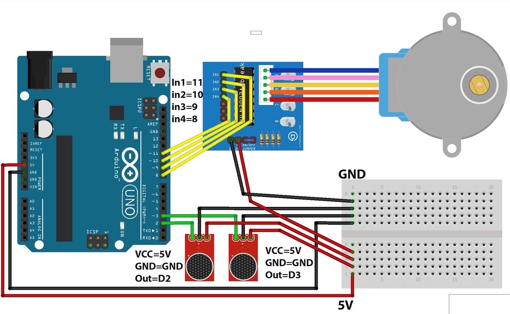
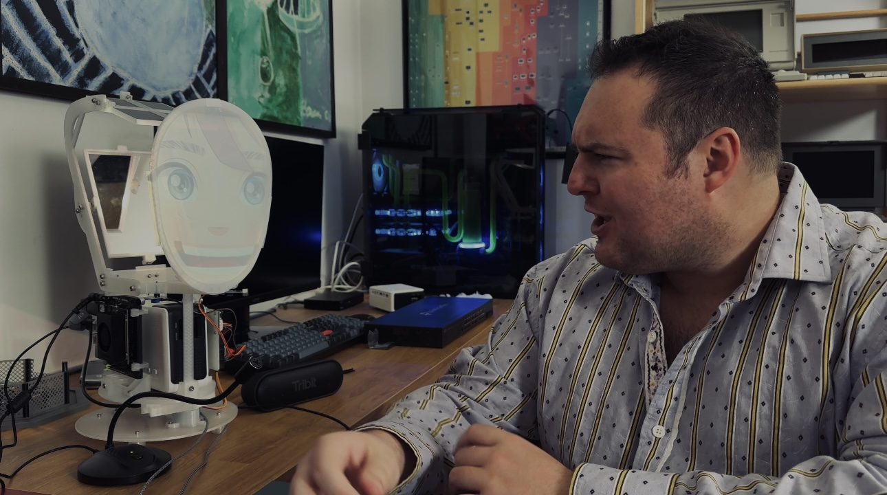

# Social Robot Build & Setup Guide


## Overview
The Social Robot project combines a 3D-printed chassis, off-the-shelf electronics, and an interactive software stack that renders a projected face while chatting via a local language model. This guide walks you through sourcing the hardware, printing parts, building the robot, and configuring the Jetson-powered software stack.

- **Mechanical build**: 33 support-free 3D printed components, mirrors, and fasteners form the body and projection system.
- **Compute & audio**: An NVIDIA Jetson Orin Nano Super Developer Kit drives the voice, speech recognition, and projection experience.
- **Software**: WebRTC-based voice activity detection, Faster-Whisper speech recognition, Kokoro-ONNX text-to-speech, and a pygame-driven face animation loop communicating with an Ollama-hosted LLM.

> **Availability & Kits (Important)**  
> Social Robot is free to make and print for personal use. For convenience, a limited number of pre-printed kits (including all parts **except** the Jetson) are available here: [ominousindustries.com](ominousindustries.com/products/ai-social-robot-kit-compatible-with-nvidia-jetson-orin-nano-super-jetson-not-included).

### Quick Links
- 📺 [Full robot build instruction video](https://vimeo.com/1120539378/5c16415a2a)
- 🎛️ [Optional Arduino head-movement video](https://vimeo.com/1120544089)


## Software Setup

### 1. OS Prerequisites (Jetson)
Install system packages once per Jetson Orin Nano to support audio, SDL, and build tooling:
```bash
sudo apt update
sudo apt install -y git curl python3-venv python3-dev build-essential \
    libportaudio2 portaudio19-dev libasound-dev \
    libsdl2-dev libsdl2-image-dev libpng-dev
```
- `pyaudio` depends on PortAudio/ALSA headers and libraries.
- `webrtcvad` and `pygame` require development headers on aarch64.
- `pygame` uses SDL2 and libpng for rendering; add SDL mixer/TTF and image codecs if needed.

If you plan to display over HDMI while logged in via SSH, start an X server on the Jetson desktop (`DISPLAY=:0` later).

### 2. Clone the Repository
```bash
git clone https://github.com/OminousIndustries/SocialRobot.git
cd SocialRobot
```

### 3. Create the Python Environment
```bash
python3 -m venv ~/robot/.venv
source ~/robot/.venv/bin/activate
python -m pip install -r requirements.txt
```
The first run downloads the Faster-Whisper `tiny.en` model and Kokoro ONNX/voice files into `~/.cache/kokoro_onnx`.

### 4. Provide Face Assets
Place `face.png` and `mouth.png` (transparent PNGs sized for your display) in the repository root, or update `FaceSettings.face_image_path` and `mouth_image_path` in `main.py`.

### 5. Install & Prepare Ollama
```bash
curl -fsSL https://ollama.com/install.sh | sh
ollama run gemma3:270m   # downloads the gemma3 270m model
```
The application reaches `http://localhost:11434/api/chat` and expects the `gemma3:270m` model in streaming mode. Keep the Ollama service running in the background (`ollama serve` if systemd is unavailable).

### 6. Configure Audio Devices
1. Connect a USB microphone and speakers/headphones.
2. Set default input/output devices via the desktop sound settings.
3. When operating headless, adjust PulseAudio defaults over SSH:
```bash
pactl list short sinks       # identify HDMI or other outputs
pactl set-default-sink <sink_name>

pactl list short sources     # identify microphone input
pactl set-default-source <source_name>
```
PulseAudio settings reset on reboot unless persisted via configuration files.

### 7. Run the Application
```bash
# inside the venv and repository root
export DISPLAY=:0        # required when launching over SSH
python main.py
```
The face renderer runs in a dedicated thread, while the VAD loop waits for speech. Whisper falls back to CPU if CUDA is unavailable; otherwise, ctranslate2 leverages GPU acceleration.

## Bill of Materials

### Electronics
- NVIDIA Jetson Orin Nano Super Developer Kit (available from Micro Center and other retailers)
- Yoton Y3 Mini Projector — <https://a.co/d/gWdswff>
- Generic USB Microphone — <https://a.co/d/i5nXfO6>
- 1 ft HDMI Cable — <https://a.co/d/eZBGOwM>
- Right-angle Male-to-Female HDMI Adapter (90° or 270°) — <https://a.co/d/8lm3JhN>
- DisplayPort-to-HDMI Adapter — <https://a.co/d/3IJHrtP>

### Hardware & Materials
- 3 mm thick 6"×4" acrylic mirrors (two required) — <https://marketingholders.com/acrylic-fashion-displays-and-organizers/acrylic-mirror-stands-and-sheets/4-x-6-acrylic-mirror-sheet-for-replacement-or-diy-crafts>
- 10 mil milky translucent PET (Mylar) sheet, 12"×12" — <https://a.co/d/gCJCugM>
- Hex socket head M4 screw and nut set — <https://a.co/d/7dKUKiq>
- Hex socket head M2/M3/M4 assorted screw and nut set — <https://a.co/d/aQrlfdq>
- 4 mm nylon spacer for sound level sensor (optional) — <https://a.co/d/1VccBdR>
- Two 1 kg rolls of 3D-printer filament in your preferred colors/materials

### Optional Head Movement System (Arduino)
- Arduino Uno R3 — <https://a.co/d/bvDaFiA>
- 28BYJ-48 stepper motor & ULN2003 driver board — <https://a.co/d/c2HEamP>
- Mini 170-point breadboard — <https://a.co/d/5Bglmuq>
- Two LM393 3-pin sound level sensors — <https://a.co/d/bQ231V5>
- Arduino jumper wires — <https://a.co/d/es0TScP>



## 3D Printed Parts

All print files are available here:  
**Printables:** <https://www.printables.com/model/1420907-ominous-industries-social-robot>

A **limited number of pre‑printed kits** (Not Including the Jetson) are available here **[ominousindustries.com](ominousindustries.com/products/ai-social-robot-kit-compatible-with-nvidia-jetson-orin-nano-super-jetson-not-included)**.

---


## Mechanical Assembly Overview
Follow along with the **[Build instruction video](https://vimeo.com/1120539378/5c16415a2a)** for step-by-step visuals. 

### Optional Head Movement System
If you plan to add head motion, watch the **[Arduino instruction video](https://vimeo.com/1120544089)**

## Runtime Expectations & Troubleshooting
- First launch may take several minutes while models download (Faster-Whisper, Kokoro assets, Ollama LLM).
- If `pyaudio` reports missing devices, confirm PulseAudio/ALSA can access hardware, or run as the desktop user instead of root.
- Adjust `FaceSettings` in `main.py` to tweak display size, rotation, and offsets.
- Change voices or playback rate by passing different parameters when constructing `KokoroTTS`. List options with `KokoroTTS().available_voices()`.
- If an Ubuntu software update window blocks the projection, locate and terminate the process:
  ```bash
  pgrep -af update
  kill <PID>
  ```
- If you are unable to get Chromium to launch on the Jetson/Jetpack 6.2, see these instructions: [Chromium Jetson Fix](https://forums.developer.nvidia.com/t/chromium-other-browsers-not-working-after-flashing-or-updating-heres-why-and-quick-fix/338891)


